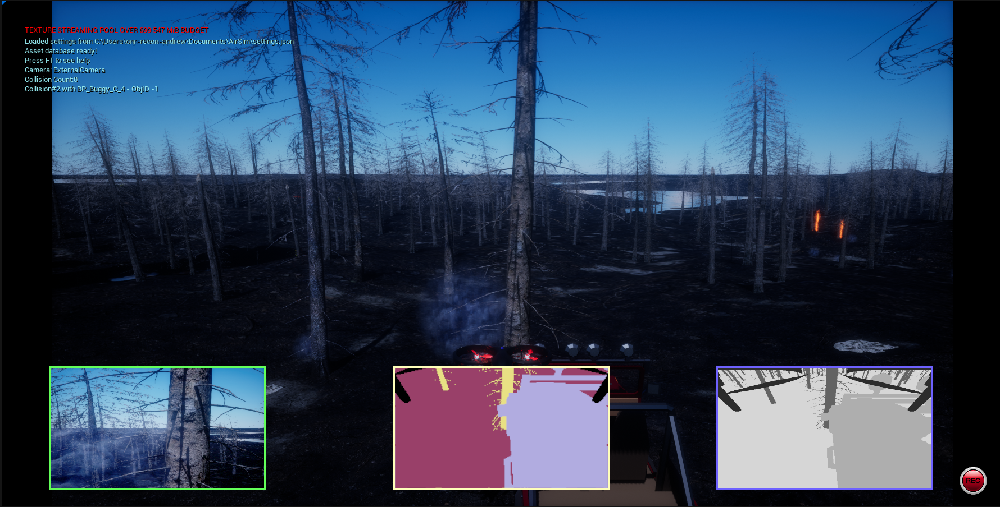

Getting Started
=====

Download
--------
To start off, please download the `FIReVision executable <https://drive.google.com/file/d/1RSxQ53h_-bXE0dUa8GQ8lM2cx7LlVmB8/view?usp=sharing>`_ to use our simulator. When you run the FIReVision executable, the wildfire environment will start out in AirSim mode with the drone on the ground stationary. To download the binary follow the instructions `here <https://microsoft.github.io/AirSim/use_precompiled/>`_.

.. - If our release build doesn’t come with AirSim, make sure there’s a copy of it in your unreal engine project folder. 
.. - Once you’ve downloaded the build and compiled it
    - To build the unreal engine project, locate the FIReVision folder and find file ending in .sln (e.g., FIReVision.sln). 
    - Inside the file, look at the top and click on Build and Build Solution. If no compiling errors occur, you are ready to open the FIReVision uproject. It can also be opened inside of the Unreal Engine application.
.. - Once in the project, go to the top left and click on File > Open Level and select FIReVision (Level).

Drone Controls
-------
Before we can start moving in AirSim mode, we must first run ``objectDetection_kbcontrol.py``. This will allow us to detect objects as well as control the drone. Finally, refer to the following table to control the drone:

.. list-table:: Movements
   :widths: 25 25
   :header-rows: 1

   * - Key
     - Action
   * - W
     - Foward
   * - A
     - Left
   * - S
     - Backward
   * - D
     - Foward
   * - Q
     - Rotate Left
   * - E
     - Rotate Right
   * - X
     - Up
   * - Z
     - Down
.. A video showing the drone flying would be nice  

Objection Detection
-----
When running ``objectDetection_kbcontrol.py`` you may have noticed a small window opening. This window displays the detection of objects in the environment, specifically crew and vehicles. It boxes the objects and labels them according to their name in the environment. We soon hope to detect the rest of the environment (e.g., the trees and fires).
.. image:: images/objection_detection.PNG
  :width: 800
  :height: 400
Setup
-----
Go into your system’s “Documents > AirSim > Settings” and copy paste the code below into that file.

  .. code-block:: JSON

    {
      "SeeDocsAt": "https://github.com/Microsoft/AirSim/blob/main/docs/settings.md",
      "SettingsVersion": 1.2,
      "SimMode": "Multirotor",
      "ViewMode": "SpringArmChase",
      "ClockSpeed": 1.0,
      "SegmentationSettings": {
        "InitMethod": "",
        "MeshNamingMethod": "",
        "OverrideExisting": false
      },
      "Vehicles": {
        "drone_1": {
          "VehicleType": "SimpleFlight",
          "DefaultVehicleState": "Armed",
          "EnableCollisionPassthrogh": false,
          "EnableCollisions": true,
          "AllowAPIAlways": true,
          "RC": {
            "RemoteControlID": 0,
            "AllowAPIWhenDisconnected": false
          },
          "Sensors": {
            "Imu" : {
              "SensorType": 2,
              "Enabled": true
            }
          },
          "Cameras": {
            "front_center_custom": {
              "CaptureSettings": [
                {
                  "PublishToRos": 1,
                  "ImageType": 0,
                  "Width": 640,
                  "Height": 480,
                  "FOV_Degrees": 27,
                  "DepthOfFieldFstop": 2.8,
                  "DepthOfFieldFocalDistance": 200.0, 
                  "DepthOfFieldFocalRegion": 200.0,
                  "TargetGamma": 1.5
                }
              ],
              "X": 0.50, "Y": 0, "Z": 0.10,
              "Pitch": 0, "Roll": 0, "Yaw": 0
            },
            "bottom_forward_thermal": {
              "CaptureSettings": [
                {
                  "PublishToRos": 1,
                  "ImageType": 10,
                  "Width": 640,
                  "Height": 512,
                  "FOV_Degrees": 95,
                  "DepthOfFieldFstop": 2.8,
                  "DepthOfFieldFocalDistance": 200.0, 
                  "DepthOfFieldFocalRegion": 200.0,
                  "TargetGamma": 1.5
                }
              ],
              "X": 0.0, "Y": 0, "Z": 0.0,
              "Pitch": -45, "Roll": 0, "Yaw": 0
            },
            "bottom_forward_infrared": {
              "CaptureSettings": [
                {
                  "PublishToRos": 1,
                  "ImageType": 0,
                  "Width": 640,
                  "Height": 480,
                  "FOV_Degrees": 95,
                  "DepthOfFieldFstop": 2.8,
                  "DepthOfFieldFocalDistance": 200.0, 
                  "DepthOfFieldFocalRegion": 200.0,
                  "TargetGamma": 1.5
                }
              ],
              "X": 0.0, "Y": 0, "Z": 0.0,
              "Pitch": -45, "Roll": 0, "Yaw": 0
            }
          },
          "X": 2, "Y": 0, "Z": 0,
          "Pitch": 0, "Roll": 0, "Yaw": 0
        }
      },
      "SubWindows": [
        {"WindowID": 0, "ImageType": 0, "CameraName": "front_center_custom", "Visible": true},
        {"WindowID": 1, "ImageType": 5, "CameraName": "bottom_forward_thermal", "Visible": true},
        {"WindowID": 2, "ImageType": 10, "CameraName": "bottom_forward_thermal", "Visible": true}
      ]
    }

Sensors
-------

When running AirSim in the FIReVision environment, three cameras should be displayed at the bottom of the screen. The leftmost camera shows RGB image, the middle camera shows semantic segmentation, and the rightmost camera shows thermal image. The code above should ensure that the cameras are set up in this fashion. However, if you don’t want a certain camera or prefer something else, please look at AirSim’s documentation on the `Images API <https://microsoft.github.io/AirSim/image_apis/>`_.

